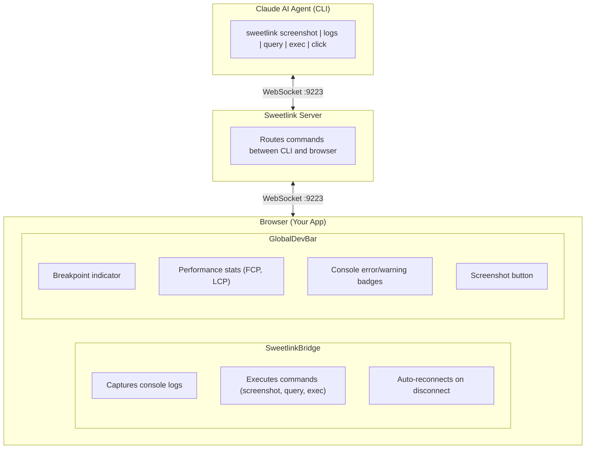

# devbar

Development toolbar and AI debugging toolkit. This monorepo contains **devbar** (development toolbar) and **sweetlink** (autonomous AI agent toolkit for browser debugging).

## What Is This?

Tools that enable AI agents (like Claude) to autonomously debug, test, and iterate on web applications through real-time browser interaction:

- **[@ytspar/devbar](./packages/devbar)** - A lightweight development toolbar showing breakpoints, performance stats, console badges, and screenshot capture. Framework-agnostic (vanilla JS) with optional Sweetlink integration.

- **[@ytspar/sweetlink](./packages/sweetlink)** - WebSocket bridge enabling AI agents to capture screenshots, query DOM, execute JavaScript, and monitor console logs in real-time. Token-efficient (~1000 tokens/screenshot vs ~5000 for alternatives).

- **[@ytspar/playground](./packages/playground)** - Demo app for testing and developing the tools.

## Requirements

- **Node.js** 18+ (see `.nvmrc` for version)
- **pnpm** 9.15.9+ (workspace-aware package manager)

## Installation

### For Development (This Repo)

```bash
# Clone the repository
git clone https://github.com/ytspar/devbar.git
cd devbar

# Install dependencies (pnpm handles workspace linking)
pnpm install

# Build all packages
pnpm build
```

### For Integration Into Your App

```bash
# Install devbar only
pnpm add @ytspar/devbar

# Install sweetlink only
pnpm add @ytspar/sweetlink

# Install both
pnpm add @ytspar/devbar @ytspar/sweetlink
```

### Canary Releases

Canary versions are published on every push to `main`:

```bash
# Install latest canary
pnpm add @ytspar/devbar@canary
pnpm add @ytspar/sweetlink@canary
```

### NPM Registry

| Package | npm |
|---------|-----|
| **@ytspar/devbar** | [](https://www.npmjs.com/package/@ytspar/devbar) |
| **@ytspar/sweetlink** | [](https://www.npmjs.com/package/@ytspar/sweetlink) |

## Environment Variables

Create a `.env` file in your project root. Sweetlink uses these variables:

| Variable | Default | Description |
|----------|---------|-------------|
| `SWEETLINK_WS_PORT` | `9223` | WebSocket server port for Sweetlink |
| `SWEETLINK_WS_URL` | `ws://localhost:9223` | WebSocket URL (used by CLI) |
| `CHROME_CDP_PORT` | `9222` | Chrome DevTools Protocol port |
| `CHROME_CDP_URL` | `http://127.0.0.1:9222` | CDP endpoint URL |
| `NODE_ENV` | - | Set to `development` to enable dev features |

### Example .env

```bash
# Sweetlink Development Bridge
SWEETLINK_WS_PORT=9223
CHROME_CDP_PORT=9222

# For CDP screenshots (optional - requires Chrome with debugging enabled)
# /Applications/Google\ Chrome.app/Contents/MacOS/Google\ Chrome --remote-debugging-port=9222
```

**Why .env?** Environment variables allow configuration without code changes, support different setups (dev/staging/prod), and keep sensitive data (like ports that might conflict) out of source control.

## Quick Start

### 1. Add Sweetlink Server

#### Remix

```typescript
// tools/sweetlink-dev.ts
import { initSweetlink, closeSweetlink } from '@ytspar/sweetlink/server';

const port = parseInt(process.env.SWEETLINK_WS_PORT || '9223', 10);
initSweetlink({ port });

// Graceful shutdown
process.on('SIGTERM', () => closeSweetlink());
process.on('SIGINT', () => closeSweetlink());
```

#### Vite

```typescript
// vite.config.ts
import { defineConfig } from 'vite';
import { initSweetlink } from '@ytspar/sweetlink/server';

if (process.env.NODE_ENV === 'development') {
  initSweetlink({ port: 9223 });
}

export default defineConfig({ /* ... */ });
```

#### Next.js

```javascript
// next.config.js
const { initSweetlink } = require('@ytspar/sweetlink/server');

if (process.env.NODE_ENV === 'development') {
  initSweetlink({ port: 9223 });
}

module.exports = { /* ... */ };
```

### 2. Add Browser Bridge

```tsx
// app/root.tsx or App.tsx
import { SweetlinkBridge } from '@ytspar/sweetlink/browser';

export default function App() {
  return (
    <>
      {/* Your app content */}
      {process.env.NODE_ENV === 'development' && <SweetlinkBridge />}
    </>
  );
}
```

### 3. Update package.json Scripts

```json
{
  "scripts": {
    "dev": "run-p dev:app sweetlink:dev",
    "dev:app": "remix dev",
    "sweetlink:dev": "tsx tools/sweetlink-dev.ts",
    "sweetlink": "sweetlink"
  }
}
```

### 4. Use CLI Commands

```bash
# Full page screenshot
pnpm sweetlink screenshot

# Element screenshot
pnpm sweetlink screenshot --selector ".my-component"

# Get console logs
pnpm sweetlink logs

# Query DOM
pnpm sweetlink query --selector "h1"

# Execute JavaScript
pnpm sweetlink exec --code "document.title"

# Click elements
pnpm sweetlink click --selector "button.submit"

# Refresh page
pnpm sweetlink refresh
```

## Adding App-Specific Functions (Custom Controls)

devbar supports registering custom controls that appear in the toolbar. This lets you add app-specific debugging functions.

### React Integration Example

Create a React wrapper that initializes devbar and provides context for custom controls:

```tsx
// app/hooks/useDevBar.tsx
import { createContext, useContext, useState, useCallback, useEffect, useRef } from "react";
import type { ReactNode } from "react";
import { initGlobalDevBar, getGlobalDevBar, destroyGlobalDevBar, GlobalDevBar } from "@ytspar/devbar";

export interface DevBarControl {
  label: string;
  onClick: () => void;
  active?: boolean;
  disabled?: boolean;
}

interface DevBarContextValue {
  setContextControls: (controls: DevBarControl[]) => void;
  clearContextControls: () => void;
}

const DevBarContext = createContext<DevBarContextValue>({
  setContextControls: () => {},
  clearContextControls: () => {},
});

export function useDevBar(): DevBarContextValue {
  return useContext(DevBarContext);
}

export function GlobalDevBarMount({ children, devMode = false }: { children?: ReactNode; devMode?: boolean }) {
  const [contextControls, setContextControls] = useState<DevBarControl[]>([]);

  useEffect(() => {
    if (typeof window === "undefined" || !devMode) return;

    initGlobalDevBar({ position: "bottom-left" });

    return () => destroyGlobalDevBar();
  }, [devMode]);

  // Forward controls to vanilla JS devbar
  useEffect(() => {
    if (!devMode) return;

    GlobalDevBar.clearControls();

    contextControls.forEach((control, index) => {
      GlobalDevBar.registerControl({
        id: `context-control-${index}`,
        label: control.label,
        onClick: control.onClick,
        active: control.active,
        disabled: control.disabled,
      });
    });
  }, [contextControls, devMode]);

  const handleSetContextControls = useCallback((controls: DevBarControl[]) => {
    setContextControls(controls);
  }, []);

  const handleClearContextControls = useCallback(() => {
    setContextControls([]);
    if (devMode) GlobalDevBar.clearControls();
  }, [devMode]);

  return (
    <DevBarContext.Provider
      value={{
        setContextControls: handleSetContextControls,
        clearContextControls: handleClearContextControls,
      }}
    >
      {children}
    </DevBarContext.Provider>
  );
}
```

### Using Custom Controls in Components

```tsx
// app/components/MyPage.tsx
import { useEffect } from "react";
import { useDevBar } from "~/hooks/useDevBar";

function MyPage() {
  const { setContextControls, clearContextControls } = useDevBar();

  useEffect(() => {
    // Register page-specific debug controls
    setContextControls([
      {
        label: "Clear Cache",
        onClick: () => {
          localStorage.clear();
          console.log("Cache cleared");
        },
      },
      {
        label: "Show Debug Info",
        onClick: () => {
          console.log("App state:", /* your state */);
        },
        active: false,
      },
      {
        label: "Reset Filters",
        onClick: () => {
          // Reset your app filters
        },
      },
    ]);

    // Cleanup on unmount
    return () => clearContextControls();
  }, [setContextControls, clearContextControls]);

  return <div>My Page Content</div>;
}
```

### Mounting in Root Layout

```tsx
// app/root.tsx
import { GlobalDevBarMount } from "~/hooks/useDevBar";

export function App() {
  const isDevelopment = process.env.NODE_ENV === "development";

  return (
    <GlobalDevBarMount devMode={isDevelopment}>
      {/* Your app content */}
      <Outlet />
    </GlobalDevBarMount>
  );
}
```

### Vanilla JS (No React)

```typescript
import { initGlobalDevBar, GlobalDevBar } from "@ytspar/devbar";

// Initialize
initGlobalDevBar({ position: "bottom-left" });

// Register custom controls
GlobalDevBar.registerControl({
  id: "clear-cache",
  label: "Clear Cache",
  onClick: () => localStorage.clear(),
});

GlobalDevBar.registerControl({
  id: "toggle-debug",
  label: "Debug Mode",
  onClick: () => (window.DEBUG = !window.DEBUG),
  active: false,
});

// Clear all custom controls
GlobalDevBar.clearControls();
```

## Running Tests

```bash
# Run tests once
pnpm test

# Watch mode (re-run on changes)
pnpm test:watch

# Generate coverage report
pnpm test:coverage
```

Tests use [Vitest](https://vitest.dev/) with `happy-dom` for DOM simulation. Test files are located alongside source files with `.test.ts` extension:

```
packages/
├── devbar/src/
│   ├── utils.ts
│   ├── utils.test.ts      # Tests for utils
│   ├── constants.ts
│   └── constants.test.ts  # Tests for constants
└── sweetlink/src/
    └── ...
```

### Writing Tests

```typescript
// packages/devbar/src/myModule.test.ts
import { describe, it, expect } from 'vitest';
import { myFunction } from './myModule';

describe('myFunction', () => {
  it('should handle basic case', () => {
    expect(myFunction('input')).toBe('expected');
  });

  it('should handle edge case', () => {
    expect(myFunction(null)).toBeUndefined();
  });
});
```

## Development

### Available Scripts

| Command | Description |
|---------|-------------|
| `pnpm build` | Build all packages |
| `pnpm dev` | Start playground dev server |
| `pnpm dev:all` | Build watch + playground in parallel |
| `pnpm typecheck` | Run TypeScript type checking |
| `pnpm clean` | Clean dist directories |
| `pnpm test` | Run tests |
| `pnpm test:watch` | Run tests in watch mode |
| `pnpm test:coverage` | Run tests with coverage |

### Package Structure

```
devbar/
├── packages/
│   ├── devbar/           # Development toolbar
│   │   ├── src/
│   │   │   ├── GlobalDevBar.ts    # Main devbar component
│   │   │   ├── constants.ts       # Theme, colors, breakpoints
│   │   │   ├── utils.ts           # Utility functions
│   │   │   └── ui/                # UI builders (buttons, modals)
│   │   └── package.json
│   │
│   ├── sweetlink/        # AI agent browser toolkit
│   │   ├── src/
│   │   │   ├── server/            # WebSocket server
│   │   │   ├── browser/           # Browser bridge component
│   │   │   ├── cli/               # CLI tools
│   │   │   └── cdp.ts             # Chrome DevTools Protocol
│   │   └── package.json
│   │
│   └── playground/       # Demo/test application
│       └── src/
│
├── vitest.config.ts      # Test configuration
├── pnpm-workspace.yaml   # Workspace definition
└── package.json          # Root scripts
```

## Architecture



## Token Efficiency

Sweetlink is designed for token-efficient autonomous loops:

| Method | Size | Tokens |
|--------|------|--------|
| html2canvas | ~131KB | ~1,000 |
| CDP screenshots | ~2.0MB | ~15,000 |

Default strategy: Use html2canvas first, escalate to CDP only when needed. This 15x savings enables 10+ autonomous iterations within Claude's budget.

### Screenshot Caveats (html2canvas)

Sweetlink's default screenshot method uses [html2canvas](https://html2canvas.hertzen.com/), which builds a canvas representation by reading DOM properties rather than capturing actual rendered pixels. This means screenshots **may not always match what you see in the browser**. Key limitations:

- **SVGs may not render correctly** — inline and external SVGs are a known trouble area and may appear broken or missing
- **CSS `filter` is unsupported** — `blur()`, `brightness()`, `drop-shadow()`, etc. will not appear
- **`box-shadow` is unsupported** — elements with shadows will render without them
- **CSS blend modes are unsupported** — `mix-blend-mode` and `background-blend-mode` are ignored
- **Cross-origin images** — images from other domains may not render unless the server provides CORS headers
- **`object-fit` is unsupported** — images using `object-fit: cover/contain` may render at incorrect aspect ratios
- **Limited `transform` support** — complex CSS transforms may not render accurately
- **No `writing-mode` or `zoom`** — these properties are ignored entirely

If you need pixel-perfect screenshots, use the CDP method instead (requires Chrome launched with `--remote-debugging-port=9222`). See [Troubleshooting > CDP Not Available](#cdp-not-available) below.

## Troubleshooting

### WebSocket Connection Fails

```bash
# Check if port is in use
lsof -i :9223

# Try different port
SWEETLINK_WS_PORT=9224 pnpm dev
```

### Browser Not Connected

1. Ensure `<SweetlinkBridge />` is rendered in your app
2. Check browser console for connection errors
3. Verify WebSocket server is running

### CDP Not Available

1. Start Chrome with debugging:
   ```bash
   /Applications/Google\ Chrome.app/Contents/MacOS/Google\ Chrome --remote-debugging-port=9222
   ```
2. Verify endpoint: `curl http://127.0.0.1:9222/json/version`

## License

MIT

## Credits

- Inspired by [Peter Steinberger's autonomous debugging](https://x.com/steipete/status/1981998733736001727)
- Powered by html2canvas, Playwright, and WebSocket
